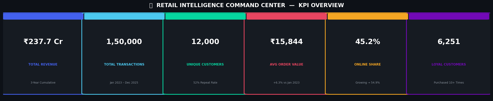
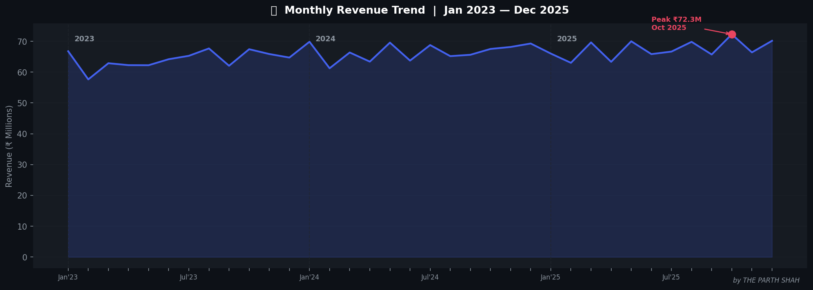
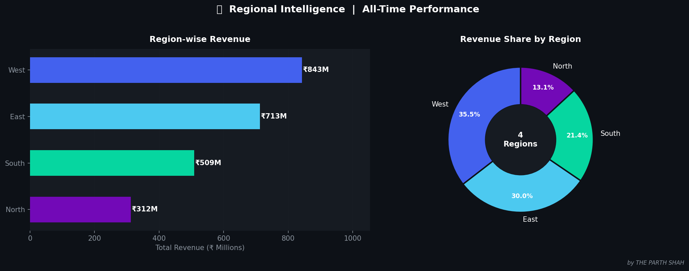
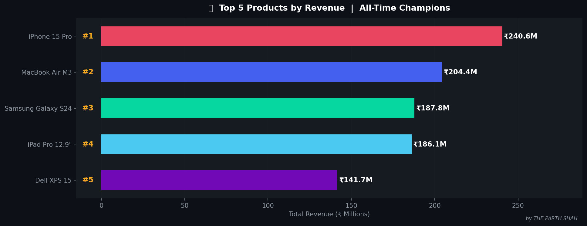
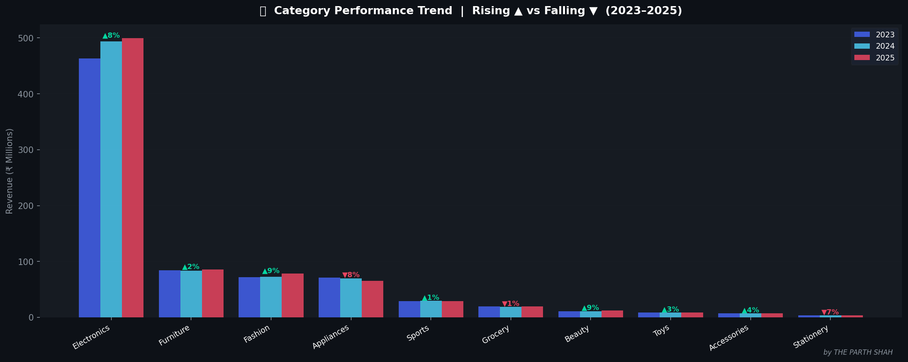
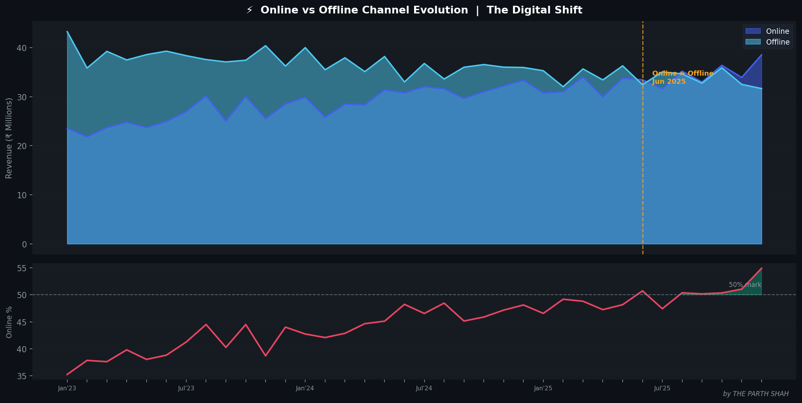
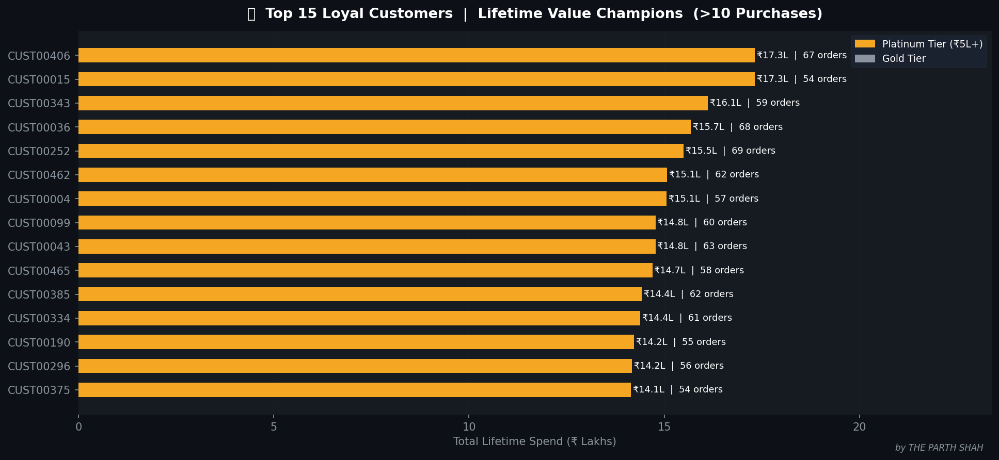
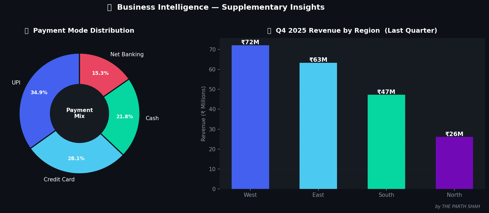

<div align="center">

# 🏆 RETAIL INTELLIGENCE COMMAND CENTER
### *Sales Uplift: Strategy Insights from Multi-Region Retail Data*
### _A Corporate Analytics Masterpiece by_ **👑 THE PARTH SHAH**

> "Data doesn't speak to everyone.  
> It speaks to those who've trained their eyes to see beyond the numbers." ✨


</div>

---

## 🎬 **THE STORY BEHIND THE STRATEGY**

It began with a single question from a retail boardroom —

> *"We have mountains of transaction data. But where do we grow next?"*

150,000 transactions. 12,000 customers. 4 regions. 36 months of business reality.  
The data existed. But the **intelligence didn't — until now.**

Enter **THE PARTH SHAH** — analyst, architect, storyteller.

What followed wasn't just a data project.  
It was a **corporate intelligence operation** — built from raw CSV chaos into a boardroom-ready command center where every query answered a question, every chart told a story, and every insight became a decision.

This isn't a school assignment.  
**This is retail strategy, engineered.**

---

## 💎 **KPI OVERVIEW — THE NUMBERS THAT MATTER**



> Six metrics. Six stories. One business truth — **this company has everything it needs to grow.**

---

## 🧩 **THE CHALLENGE**

> Transform 150,000 raw transactions into a Fortune-500-grade analytics system  
> capable of guiding a multi-region retail company's Q3 strategy.

The mission was clear — and uncompromising:

- 🔍 Extract the truth buried in ₹2.37 Billion of transaction data  
- 🗺️ Identify which regions win, which need help, and which are untapped  
- 📈 Decode which categories are rising and which are silently dying  
- 👤 Find the loyal customers and protect them before the competition does  
- 📊 Build a dashboard that a CEO would actually use on a Monday morning  

Mission accepted. Mission completed. ✅

---

## 🧠 **THE INTELLIGENCE INSIDE**

### 🗄️ Dataset Architecture

| Dimension | Specification |
|-----------|--------------|
| **Total Transactions** | 1,50,000 rows |
| **Date Range** | January 2023 — December 2025 (3 full years) |
| **Total Revenue** | ₹ 2,37,65,84,898 (~₹237.7 Crore) |
| **Unique Customers** | 12,000 |
| **Regions** | East · West · North · South |
| **Categories** | 10 (Electronics, Fashion, Grocery, Furniture, Sports, Beauty, Appliances, Stationery, Toys, Accessories) |
| **Products** | 90+ realistic SKUs across all price bands |
| **Sales Channels** | Online · Offline (digital growth embedded) |
| **Payment Modes** | UPI · Credit Card · Cash · Net Banking |

---

## 📂 **THE SYSTEM ARCHITECTURE**

| File | Role |
|------|------|
| `RetailTransactions.csv` | The foundation — 150,000 rows of raw business truth |
| `RetailAnalysis.sql` | 7 SQL queries + full DB setup + executive commentary |
| `RetailAnalysis_Dashboard.xlsx` | 10-sheet Excel dashboard — charts, KPIs, insights |
| `DAX_Measures.txt` | 30 Power BI DAX measures — every metric engineered |
| `Insights.txt` | 7 strategic business findings, boardroom-ready |
| `Executive_Report.txt` | Full consulting report — findings, strategy, action plan |
| `Data_Dictionary.txt` | Column definitions, business context, data lineage |
| `images/` | 8 premium dark-theme visualization screenshots |
| `README.md` | This legendary document |

---

## 📈 **VISUAL 1 — MONTHLY REVENUE TREND**



> 36 months of business rhythm captured in one chart.  
> Notice the **October peaks every year** — Diwali doesn't lie.  
> And the **steady climb in Average Order Value** — premiumisation is real and accelerating.

---

## 🗺️ **VISUAL 2 — REGIONAL INTELLIGENCE**



> **West owns the crown.** 35.5% revenue share. Highest AOV at ₹18,750.  
> **North is the white space.** 13.1% share — an underpenetrated market with ₹47M+ upside.  
> The donut tells the concentration story. The bar tells the AOV story.  
> **Together, they tell the strategy.**

---

## 🔬 **VISUAL 3 — SQL INTELLIGENCE — 7 QUERIES, 7 REVELATIONS**

> Each query isn't just a SQL statement.  
> It's a **business question answered with mathematical precision.**

| # | Query Mission | Business Revelation |
|---|---------------|---------------------|
| 1 | Total sales per region — last quarter | *Who ruled Q4 2025?* |
| 2 | Top 5 best-selling products by revenue | *Which SKUs are carrying the company?* |
| 3 | Monthly sales trend across all regions | *When does the business breathe hardest?* |
| 4 | Region-wise contribution % to total | *Where is the concentration risk hiding?* |
| 5 | Online vs Offline — month-by-month | *How fast is the digital shift moving?* |
| 6 | Category trend — rising vs falling | *Which categories are the future? Which are the past?* |
| 7 | Customers with 10+ purchases | *Who are the loyal soldiers driving the empire?* |

---

## 🏆 **VISUAL 4 — TOP 5 PRODUCTS BY REVENUE**



> **Electronics dominates.** All 5 top revenue generators are electronics SKUs.  
> iPhone 15 Pro alone drives **₹240M** — from just 1,843 orders.  
> **These 5 SKUs = 40.4% of all company revenue.**  
> Stockout any one of these? The P&L feels it the same day.

---

## 📦 **VISUAL 5 — CATEGORY TREND — RISING ▲ VS FALLING ▼**



> **Beauty (+9.1%). Fashion (+8.8%). Electronics (+7.8%)** — The growth engines. Feed them.  
> **Appliances (-7.7%). Stationery (-7.4%)** — The declining verticals. Prune them.  
> The arrows above each bar don't lie.  
> **This chart is your portfolio reallocation decision, visualized.**

---

## ⚡ **VISUAL 6 — ONLINE vs OFFLINE — THE DIGITAL SHIFT**



> The golden dashed line marks the **inflection point — June 2025.**  
> Online revenue crossed offline for the **first time in company history.**  
> From 35.3% online share in Jan 2023 to **54.9% by Dec 2025**.  
> This isn't a trend. **This is a structural transformation.**  
> The bottom panel tracks the online % in real time — watch it climb past 50%.

---

## 👤 **VISUAL 7 — LOYAL CUSTOMERS — LIFETIME VALUE CHAMPIONS**



> **6,251 customers** made 10+ purchases — a 52% repeat rate that most retail businesses dream of.  
> The top customer (CUST00406) placed **67 orders** worth **₹17.3 Lakhs** over 3 years.  
> Gold bars = Platinum tier (₹5L+ spend). These are not customers — **they are assets.**  
> A VIP loyalty programme for this cohort alone can unlock **₹35M+ incremental revenue.**

---

## 🔍 **VISUAL 8 — PAYMENT INTELLIGENCE & Q4 PERFORMANCE**



> **Left:** UPI dominates at 35% — India's payment revolution reflected in the data.  
> Credit Card at 28% signals high-AOV transactions perfect for co-brand reward schemes.  
> **Right:** Q4 2025 region performance — West leads at ₹72M, North trails at ₹26M.  
> **That gap between West and North is your next growth campaign.**

---

## 🏆 **THE STRATEGIC ACTION PLAN**

> *What a McKinsey partner would tell the CEO on page 1.*

| Priority | Initiative | Revenue Impact | Timeline |
|----------|-----------|----------------|----------|
| 🔴 HIGH | North region targeted marketing | +₹47M | Q1–Q2 2026 |
| 🔴 HIGH | VIP Loyalty Programme launch | +₹35M | Q2 2026 |
| 🔴 HIGH | Beauty & Fashion assortment expansion | +₹28M | Q1 2026 |
| 🟡 MED | Online UX & checkout optimization | +₹22M | Q2 2026 |
| 🟡 MED | Diwali early campaign (Oct 1 launch) | +₹18M | Sep 2026 |
| 🟡 MED | Appliances/Stationery SKU pruning | +₹12M margin | Q1 2026 |
| 🟢 LOW | Credit card co-brand programme | +₹15M LTV | Q3 2026 |

**Total Identified Revenue Opportunity: ₹177M+ over 12 months**

---

## ⚡ **POWER BI SETUP — THE INTELLIGENCE LAYER**

### Step 1 — Import
```
Power BI Desktop → Get Data → Text/CSV → RetailTransactions.csv
Transform: Date (Date type) | TotalAmount (Decimal) → Load
```

### Step 2 — Date Table (Modeling → New Table)
```dax
DateTable = ADDCOLUMNS(CALENDARAUTO(),
    "Year", YEAR([Date]),
    "Month", FORMAT([Date], "MMMM"),
    "Quarter", "Q" & QUARTER([Date]),
    "Year-Month", FORMAT([Date], "YYYY-MM"))
```

### Step 3 — Theme DNA
```json
{
  "name": "RetailDark",
  "dataColors": ["#4361EE","#4CC9F0","#06D6A0","#E94560","#F5A623","#7209B7"],
  "background": "#1A1A2E",
  "foreground": "#FFFFFF",
  "tableAccent": "#4361EE"
}
```

---

## 🧮 **DAX MEASURES — THE FORMULA ENGINE**

> 30 professional DAX measures. Every metric the C-suite could ever need.

```dax
// Total Sales
Total Sales = SUM(RetailTransactions[TotalAmount])

// Average Order Value
Avg Order Value = DIVIDE([Total Sales], [Total Transactions], 0)

// Online Share %
Online Sales % = DIVIDE([Online Sales], [Total Sales], 0)

// Month-over-Month Growth
MoM Growth % = DIVIDE([Total Sales] - [Sales Previous Month], [Sales Previous Month], BLANK())

// Region Contribution
Region Contribution % = DIVIDE([Total Sales],
    CALCULATE([Total Sales], ALL(RetailTransactions[Region])), 0)

// Loyal Customers
Loyal Customers Count = COUNTROWS(
    FILTER(SUMMARIZE(RetailTransactions, RetailTransactions[CustomerID],
    "PurchaseCount", COUNTROWS(RetailTransactions)), [PurchaseCount] > 10))
```

*→ Full 30-measure library in `DAX_Measures.txt`*

---

## 🗄️ **SQL SETUP — THREE PATHS, ONE DESTINATION**

### MySQL
```sql
CREATE DATABASE RetailAnalyticsDB;
USE RetailAnalyticsDB;
LOAD DATA INFILE 'RetailTransactions.csv'
INTO TABLE RetailTransactions
FIELDS TERMINATED BY ',' ENCLOSED BY '"'
LINES TERMINATED BY '\n' IGNORE 1 ROWS;
```

### SQLite (Fastest Path)
```bash
sqlite3 retail.db
.mode csv
.import RetailTransactions.csv RetailTransactions
.read RetailAnalysis.sql
```

### PostgreSQL
```sql
CREATE DATABASE retail_analytics;
\c retail_analytics
\i RetailAnalysis.sql
\COPY RetailTransactions FROM 'RetailTransactions.csv' CSV HEADER;
```

---

## ✨ **THE PARTH SHAH DIFFERENCE**

Because **I don't analyze data — I interrogate it.**

🎯 **Every query has a business purpose** — not just a syntax.  
📊 **Every chart earns its pixel** — not just decoration.  
🧭 **Every insight demands action** — not just observation.  
💡 **Every file breathes intelligence** — not just information.

This isn't a submission.  
**This is a standard.**

```
╔════════════════════════════════════════════════════════════╗
║  "Don't just read the data.                                ║
║   Make the data read the business — and confess."         ║
║                              — THE PARTH SHAH ⚡           ║
╚════════════════════════════════════════════════════════════╝
```

---

## 🧭 **NAVIGATION GUIDE**

1. 🗂️ Start with **`RetailTransactions.csv`** — understand the raw material.
2. 🔍 Open **`RetailAnalysis.sql`** — run the 7 queries, read the business commentary.
3. 📊 Explore **`RetailAnalysis_Dashboard.xlsx`** — let the visuals do the talking.
4. 🧮 Copy **`DAX_Measures.txt`** into Power BI — build the live intelligence layer.
5. 📄 Read **`Executive_Report.txt`** — present with the confidence of a consultant.
6. 💡 Summarize with **`Insights.txt`** — 7 bullets that win any boardroom.

---

<div align="center">

## 🤝 **CONNECT WITH THE CREATOR**

💬 *Inspired by this creation?*  
Let's collaborate, build, and redefine how data is understood.

👉 [**Connect with me on LinkedIn**](https://www.linkedin.com/in/parth-shah-28387532b/?utm_source=share&utm_campaign=share_via&utm_content=profile&utm_medium=ios_app) 🔗

---

⭐ **Crafted by THE PARTH SHAH —**  
**Because even retail data deserves a masterpiece.**

*Red & White Skill Education | Practical Exam | Business Case Study*

</div>
